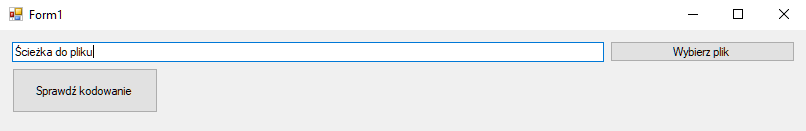

# Coding Checker

The Coding Checker application allows you to check in which format the file is encoded.
File encoding is displayed when you enter the path manually or select it from the file explorer and click on the main button.

## Supported character encodings
* ASCII
* UTF-8 
* UTF-8 (with a BOM)
* UTF-16 LE
* UTF-16 BE
* UTF-32 LE
* UTF-32 BE
* UTF-7 (with a BOM)
* UTF-1 (with a BOM)
* UTF-EBCDIC
* SCSU
* BOCU-1
* GB18030

**Application can also check if a file is a binary file.**

Files used for testing: [testFiles](testFiles)